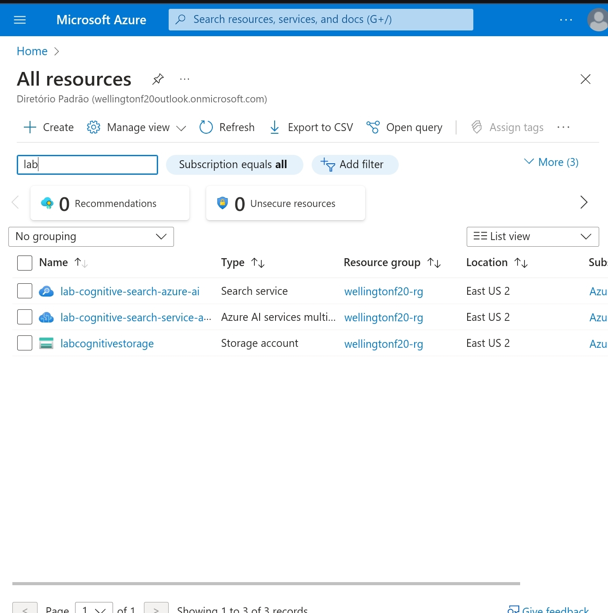
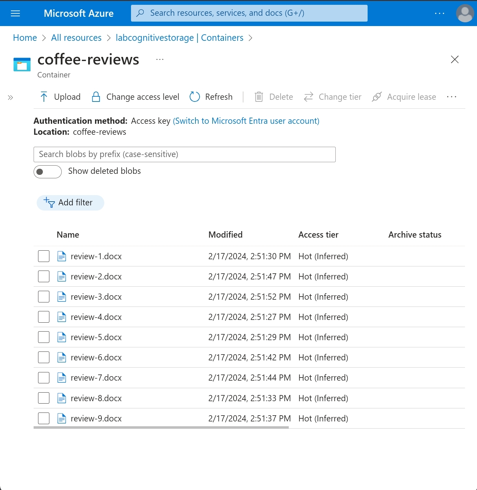
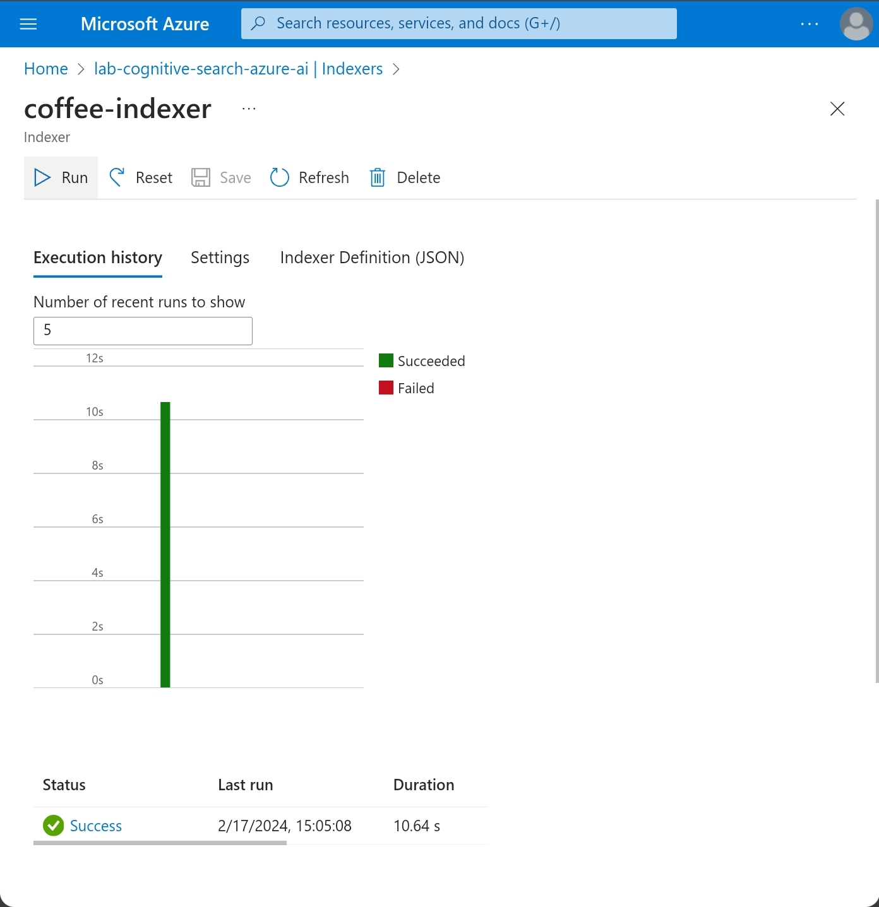
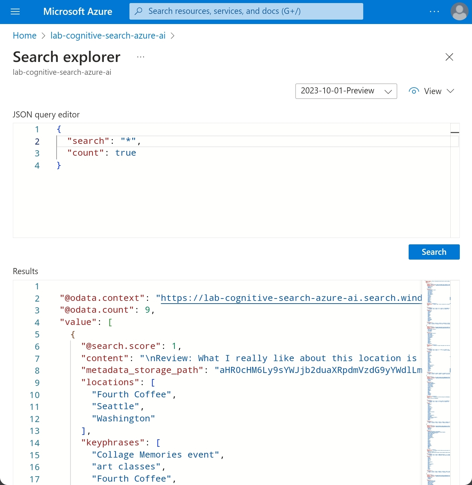
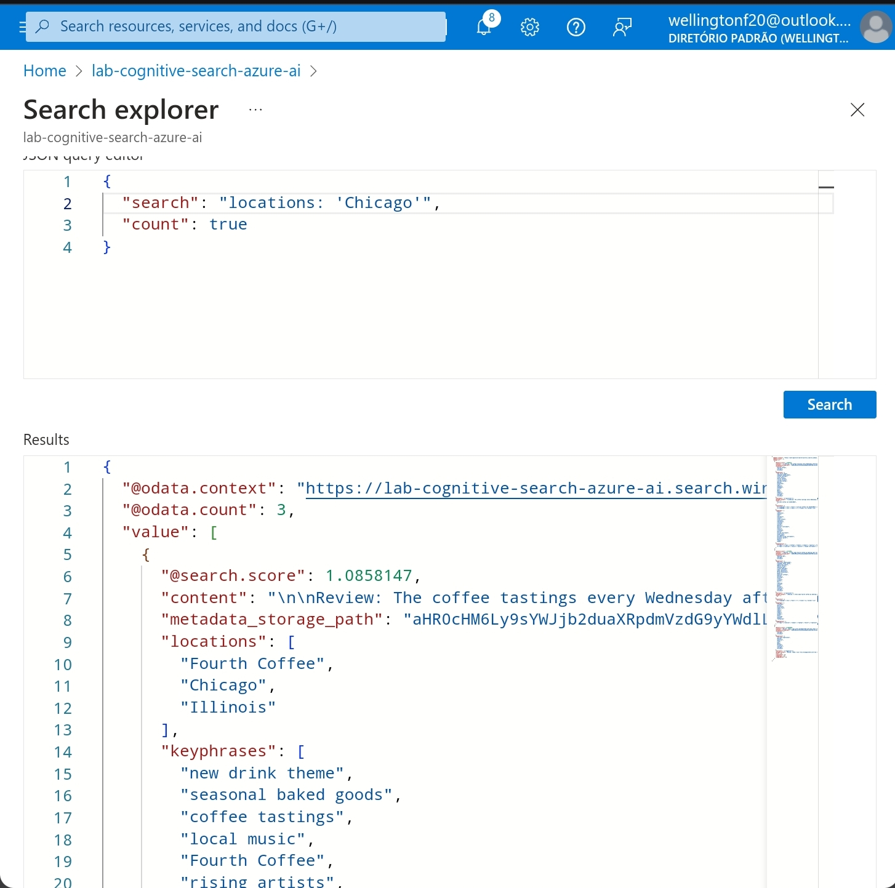
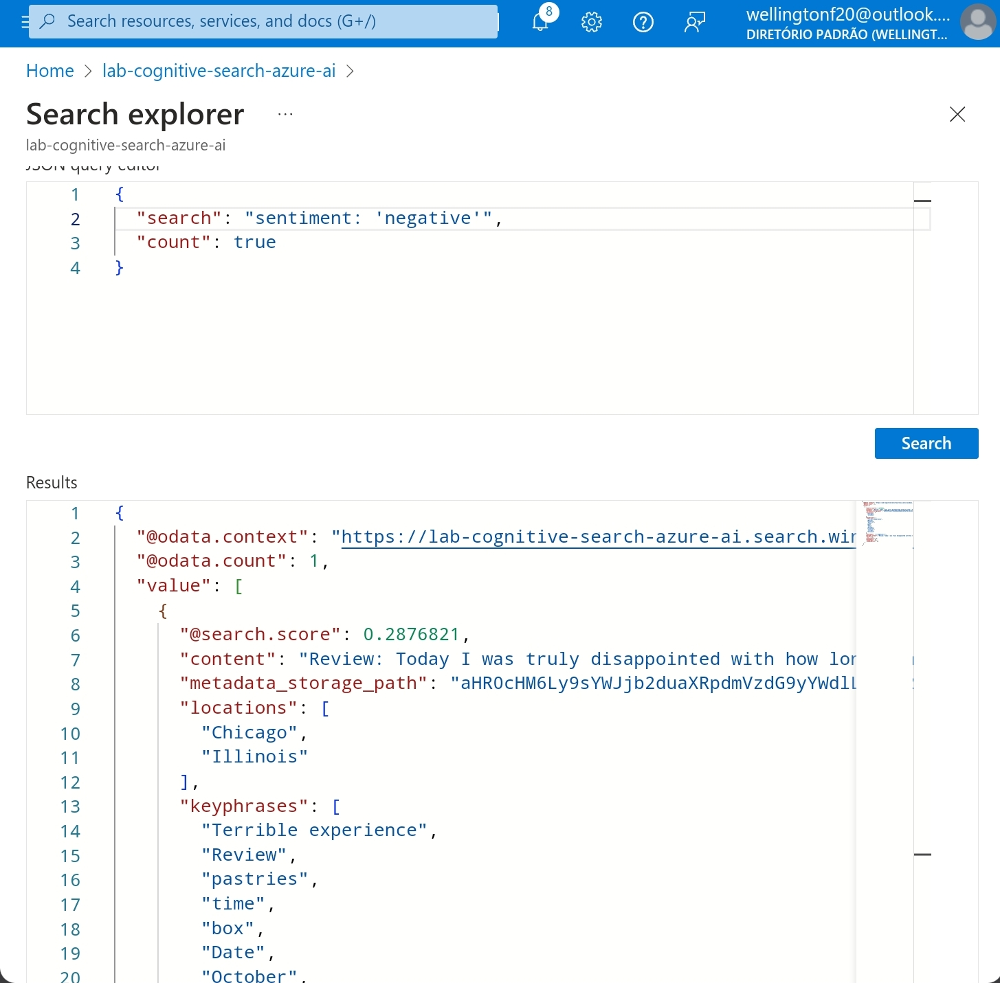

# Azure Cognitive Search: Utilizando AI Search para indexação e consulta de Dados

Repository created to pratice resources of Azure AI to Cognitive Seach with indexing and data consult.

## Azure cognitive search

Azure Cognitive Search, formerly known as Azure Search, is a cloud-based service offered by Microsoft that helps you build powerful and intelligent search experiences for your applications. It provides features for indexing, querying, and retrieving information from various sources, including text, images, and other data types.

## Steps to use

1. Create Azure Resources
    - Azure AI Search resource
    - Azure AI services resource (same location as Search)
    - Storage account with a container for raw documents
2. Upload Customer Reviews
    - Download sample reviews and extract them to a folder.
    - Upload the reviews to a container named ˋcoffee-reviewˋ in your storage account.
3. Index the Documents
    - Use the "Import data" wizard in the Azure portal.
    - Select "Azure Blob Storage" as the data source and connect to your ˋcoffee-reviewsˋ container.
    - Enable Cognitive Services and create a skillset named ˋcoffee-skillsetˋ.
    - Select the "Enable OCR" option and choose relevant enrichments like sentiment analysis, key phrase extraction, and image processing.
    - Configure a knowledge store to store enriched data.
    - Create an index named ˋcoffee-indexˋ and map the extracted fields.
    - Set up an indexer named ˋcoffee-indexerˋ to run the indexing pipeline automatically.
4. Query the Index
    - Use the Search explorer tool in the Azure portal.
    - Run basic search queries to test the index functionality.
    - Filter results by location, sentiment, and other criteria.
    - Analyze key phrases associated with negative reviews to understand potential issues.
5. Review the Knowledge Store
    - Explore the knowledge store container in your storage account.
    - View the ˋobjectprojection.jsonˋ file to see enriched data for each document.
    - Access stored images and key phrase tables for further analysis.

## Test

### Input

1. Put the reviews documents at the storage (located on ./inputs).
2. Run analysis.

### Output

## Insights

Azure Cognitive Search empowers you with

- **Traditional text search:** Find specific terms, refine results, personalize experiences.
- **AI-powered search:** Discover similar documents, gain insights with AI models, even ask questions in natural language.
- **Scalability, security, ease of use, and customization:** Build the search solution you need.

Use cases: websites, knowledge bases, document search, chatbots, and more!

